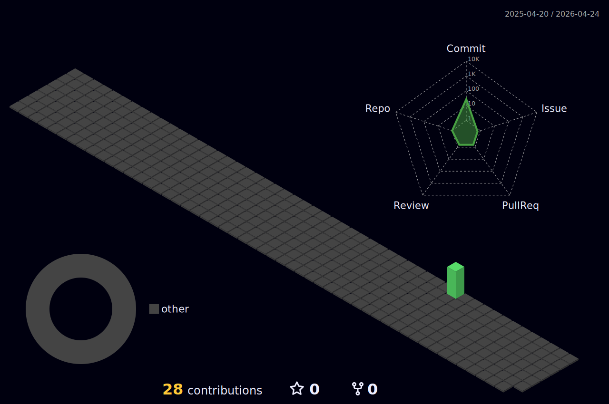

<div align="center">
  
</div>

---

<div align="center">
  

  # Hi there!

  ### Demo

</div>

---

<div align="center">
  <a href="https://git.io/typing-svg"></a>
</div>

---

<div align="center">
  <a href="https://github.com/isumenuka" target="_blank">
    
  </a>
  <a href="https://linkedin.com/ezsumm" target="_blank">
    
  </a>
  <a href="https://x.com/itzesuma" target="_blank">
    
  </a>
  <a href="https://youtube.com/itzesuma" target="_blank">
    
  </a>
  <a href="https://discord.com/esum4" target="_blank">
    
  </a>
  <a href="https://instagram.com/esum4.real" target="_blank">
    
  </a>
  <a href="https://isumenuka.me" target="_blank">
    
  </a>
  <a href="https://www.facebook.com/itzesuma" target="_blank">
    
  </a>
</div>

---

<table>
<tr>
<td valign="top" width="60%">

<div align="justify">

### 👋 Greetings, Slayer!

I am a Code Hashira, forging scalable systems and refined interfaces through relentless training.
- 🔭 Currently on missions for **High-Rank Slayer Projects**
- 🌱 Mastering new **Breathing Styles**

</div>

</td>
<td valign="center" width="40%">
<div align="center">

</div>
</td>
</tr>
</table>

---

## 👨‍💻 Who Am I?

```javascript
const developer = {
  location: "Internet",
  role: "Digital Craftsman",
  interests: ["Coding", "Coffee", "Gaming"],
  currentlyLearning: ["AI Agents", "System Design"],
};
```

---

## 📊 Stats

[](https://github.com/Jurredr/github-widgetbox)

<div align="center">
  
</div>

---

## 🚀 Technologies

<div align="center">
  <a href="https://skillicons.dev">
    
  </a>
</div>

---

## 💻 Tech Stack

<div align="center">
  
  
  
  
  
  
</div>

---

<div align="center">
  
</div>

---

<div align="center">
  
</div>

---

## 🛠 Toolbox

### Languages
[](https://github.com/Jurredr/github-widgetbox)

### Frameworks
[](https://github.com/Jurredr/github-widgetbox)

### Tools
[](https://github.com/Jurredr/github-widgetbox)

---

<div align="center">
  
</div>

---

<div align="center">
  
</div>

---

<div align="center">
  
</div>

